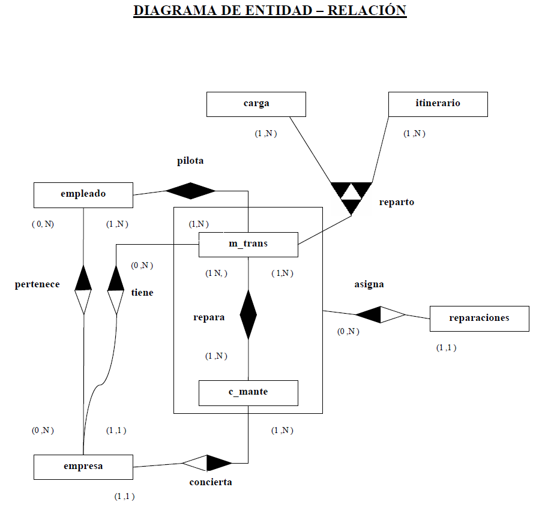
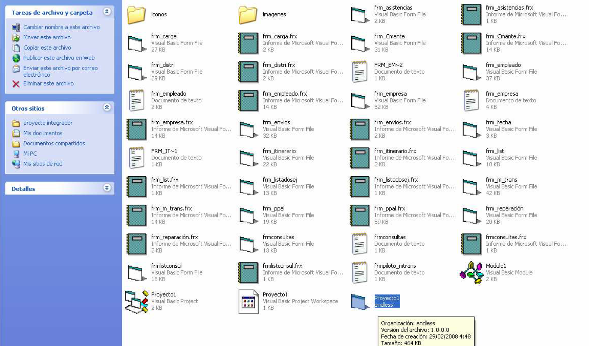
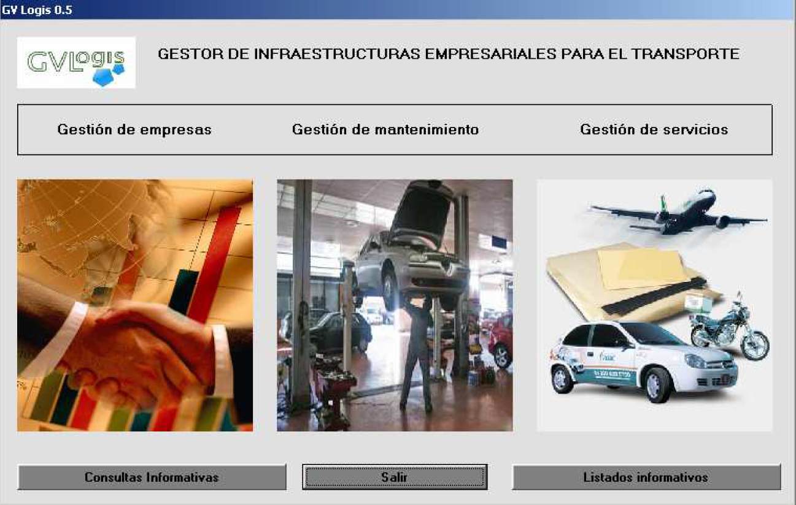

# GVLogis

In this case, it's a desktop application capable of proficiently managing the business, logistics, and maintenance operations of a goods transportation company. This development brings back very good memories. 

The stack consists of Visual Basic, the .NET environment, and Microsoft SQL Server.

Object-oriented programming was meticulously applied, focusing on comprehensive case handling and error management, complemented by a design that reflects the era.

 I hope this work can serve as a valuable reference for my coding approach as well as for the contributions of my colleague, Juan Carlos Ramirez, with whom I developed this application. 
 
 The project showcases object-oriented programming and a relational database architecture, offering flexibility for both businesses and their employees.

## Table of Contents 

- [Stack](#stack)
- [Setup](#setup)
- [Manuals Preview](#manuals-preview)
- [Author](#author)

## Stack 

## Execution 

Follow the manuals for both local database and visual studio deployment. Follow the SO guidelines for the desktop application installation. 

Keep in mind this was developed back in 2008 so if you encounter compatibility issues, execute as admin in WinXP modality. Right click on Proyecto1.vbp and get ready for the rock and roll!.

## Setup

[Link to User Manual](./doc/manual.pdf)

Application Installation

[Link to Setup instructions](./doc/setup.pdf)

Database Reference

[Database guide](./doc/database.pdf)

## Manuals Preview

## Author

- **David Ochando Blasco** - Project Developer
  - [GitHub](https://github.com/Dave86dev) - [LinkedIn](https://www.linkedin.com/in/david-ochando-blasco-90b2ba1a/)
- **Juan Carlos Ramirez** - Project Developer
  